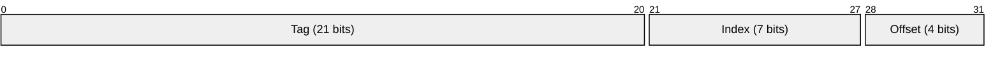
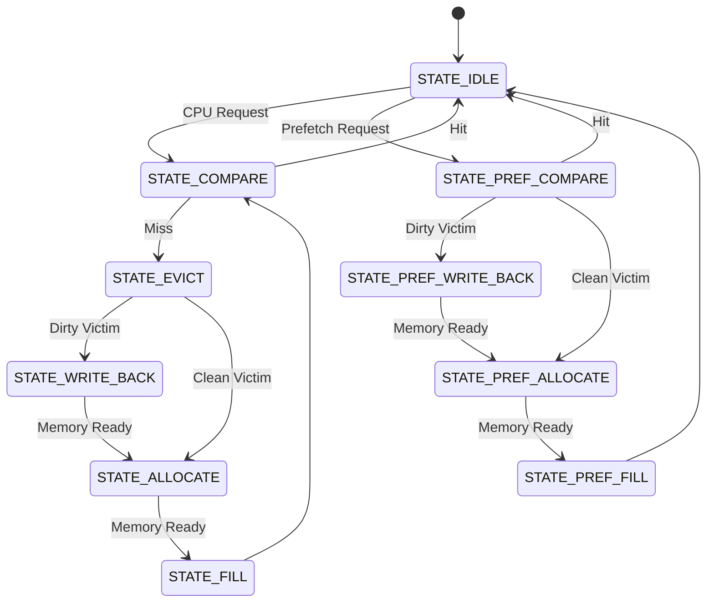
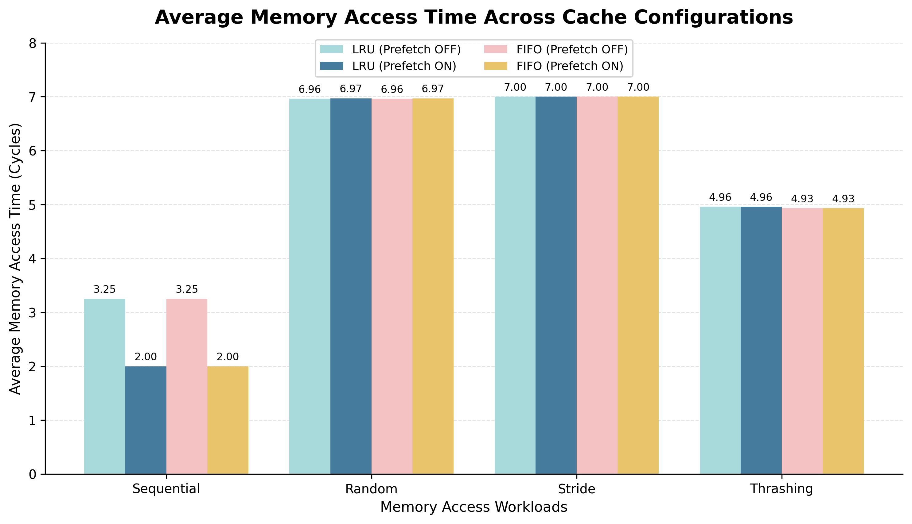
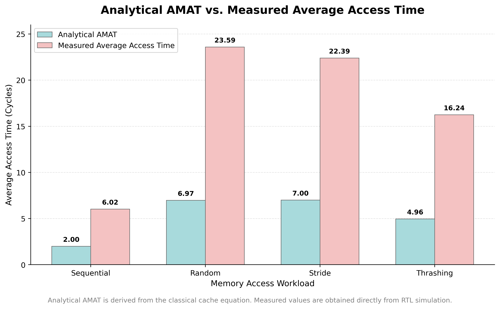

# Parameterized 2-Way Set-Associative L1 Cache Controller with Configurable Replacement Policies and Next-Line Prefetching

A synthesizable **SystemVerilog** implementation of a parameterized **2-way set-associative L1 cache controller** featuring configurable **LRU/FIFO replacement policies**, **write-back/write-allocate caching**, and an optional **next-line hardware prefetcher**.

The RTL implementation is validated against an independent **Python architectural golden model**, achieving identical architectural behavior across multiple workloads, replacement policies, and prefetch configurations.

---

# Project Overview

This repository implements a configurable L1 cache controller together with a trace-driven verification environment and Python architectural reference model.

### Features

- Parameterized cache architecture
- 2-Way set-associative cache
- Write-back & Write-allocate policy
- LRU and FIFO replacement policies
- Optional next-line hardware prefetcher
- Independent demand and prefetch FSM paths
- Trace-driven verification
- Python golden model validation

---

# Repository Structure

```text
.
├── rtl/
│   ├── cache_controller.sv
│   ├── cache_datapath.sv
│   ├── replacement_logic.sv
│   ├── prefetcher.sv
│   └── cache_pkg.sv
│
├── test/
│   └── tb_cache_top.sv
│
├── model/
│   ├── cache_sim.py
│   ├── prefetch_sim.py
│   └── replacement.py
│
├── workloads/
│
├── docs/
│   ├── architecture_spec.md
│   └── evaluation_metrics.md
│
├── images/
│
└── README.md
```

---

# Documentation

Detailed documentation describing the cache architecture and evaluation methodology is available below:

- **[Architecture & Specifications](docs/architecture_spec.md)**
- **[Evaluation Report](docs/evaluation_report.md)**

---

# Cache Configuration

| Parameter | Default |
|-----------|--------:|
| Capacity | 4 KB |
| Associativity | 2-Way |
| Block Size | 16 Bytes |
| Sets | 128 |
| Address Width | 32-bit |
| Memory Latency | 4 Cycles |

### Address Format

```text
+----------------------+---------+--------+
|        Tag           | Index   | Offset |
+----------------------+---------+--------+
|      21 bits         | 7 bits  | 4 bits |
+----------------------+---------+--------+
```



---

# Module Overview

| Module | Description |
|--------|-------------|
| `cache_controller.sv` | Cache FSM, memory interface and control logic |
| `cache_datapath.sv` | Tag, data, valid and dirty arrays |
| `replacement_logic.sv` | LRU and FIFO replacement logic |
| `prefetcher.sv` | Sequential next-line prefetch engine |

---

# Cache Controller FSM

The controller maintains independent execution paths for processor requests and speculative prefetch requests.




---


# Simulation

The project can be simulated using standard SystemVerilog simulators such as **Synopsys VCS**, **Icarus Verilog**, or **Verilator**. Compile the RTL and testbench using any simulator, then select the desired workload and cache configuration using runtime `+plusargs`.

**LRU (Default)**

```bash
./simv +TRACE=random.trc
```

**FIFO**

```bash
./simv +TRACE=random.trc +FIFO
```

**LRU + Prefetch**

```bash
./simv +TRACE=random.trc +PREFETCH
```

**FIFO + Prefetch**

```bash
./simv +TRACE=random.trc +FIFO +PREFETCH
```

---

# Validation Summary

The cache controller was validated against an independent Python architectural golden model using multiple workloads, replacement policies, and prefetch configurations. For every configuration, the RTL statistics were compared against the software model to verify architectural correctness.

| Workloads | Replacement Policies | Prefetch Modes | Total Configurations |
|-----------|---------------------:|---------------:|---------------------:|
| Sequential, Random, Stride, Thrashing | LRU, FIFO | ON / OFF | **16** |

### Validated Metrics

The following architectural metrics were verified for every configuration:

- Cache Hits
- Cache Misses
- Hit Rate
- Dirty Evictions (Write-Backs)
- Memory Reads
- Memory Writes
- Total Memory Traffic
- Average Memory Access Time (AMAT)

### Measured Performance

In addition to the analytical AMAT used by the Python reference model, the RTL reports a measured average access time obtained directly from simulation.

The measured values capture implementation effects such as memory-port contention and request serialization. While the next-line prefetcher reduces access time for sequential workloads, it increases contention for random and stride workloads, highlighting the trade-off between aggressive prefetching and memory bandwidth utilization.

Detailed measurements are available in **docs/evaluation_report.md**.

---
# Results

The RTL implementation was validated against an independent Python architectural golden model across **16 cache configurations**, covering four workloads, two replacement policies, and both prefetch modes. The RTL matched the reference model for cache hits, misses, dirty evictions, memory traffic, and analytical AMAT across every evaluated configuration.

```text
Analytical AMAT = Hit Time + (Miss Rate × Miss Penalty)
```

> The figure below summarizes the **Average Memory Access Time (AMAT)** for all validated workloads. It compares **LRU** and **FIFO** replacement policies with the prefetcher enabled and disabled, illustrating the performance impact of hardware prefetching under different memory access patterns.

<p align="center">
    
</p>

**Key Observations**

- The hardware prefetcher reduces analytical AMAT from **3.25 → 2.00 cycles** for sequential workloads by exploiting spatial locality.
- Random and stride workloads show negligible improvement because speculative memory accesses provide little cache reuse.
- LRU and FIFO replacement policies exhibit nearly identical performance, with only a minor difference observed for the thrashing workload.
- RTL simulation results match the Python architectural model across all validated metrics, including hit rate, memory traffic, dirty evictions, and analytical AMAT.

---

### Measured Performance

In addition to the analytical AMAT, the RTL also reports a **Measured Average Access Time**, computed directly from simulation as:

```text
Measured Average Access Time = Total Simulation Cycles / Total Memory Accesses
```

Unlike the analytical AMAT, this metric captures implementation-level effects such as controller overhead, request serialization, shared memory-port contention, and speculative prefetch traffic.

> The figure below compares the analytical AMAT with the measured average access time. While the analytical model depends only on cache hit rate and miss penalty, the measured metric reflects the actual execution behavior of the RTL implementation.

<p align="center">
    
</p>

**Key Observations**

- Sequential workloads benefit from hardware prefetching, reducing both analytical AMAT and measured average access time.
- For Random and Stride workloads, measured average access time increases significantly with prefetching despite nearly unchanged hit rates, demonstrating the impact of speculative memory traffic on the shared memory interface.
- The difference between the two metrics highlights that the classical AMAT equation does not capture memory-port contention or controller timing effects.
- These observations motivate future enhancements such as adaptive or selective prefetching policies that can reduce unnecessary memory traffic while preserving the benefits of hardware prefetching.

For a complete performance evaluation, workload statistics, and validation data, refer to **`docs/evaluation_report.md`**.