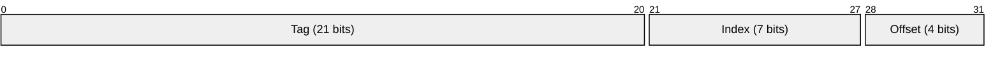
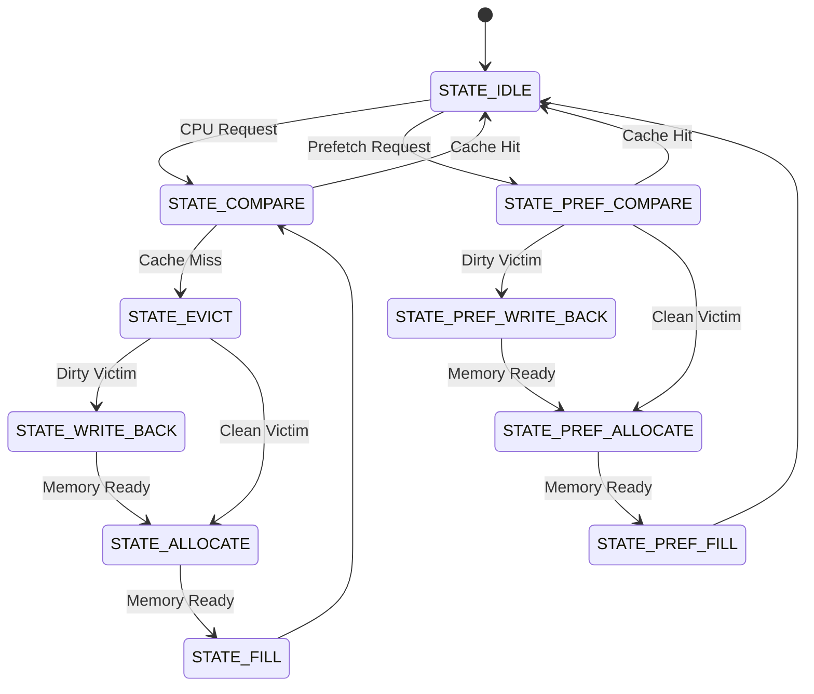
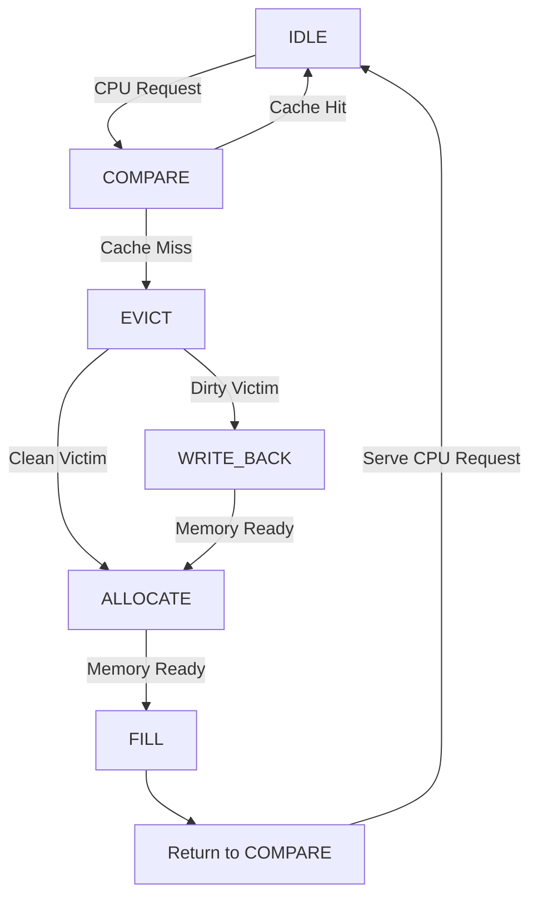
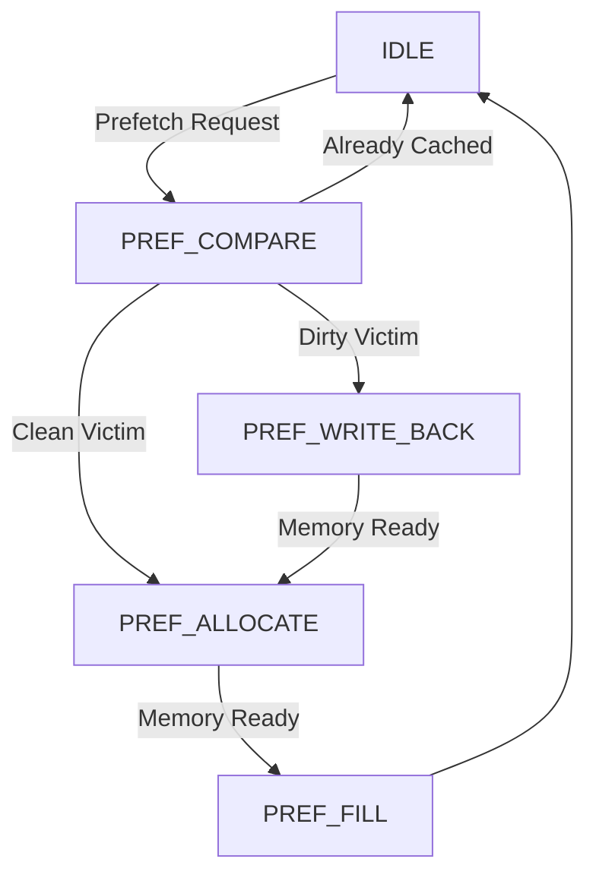

# Architecture & Specifications

This document describes the architecture, organization, and implementation details of the parameterized 2-way set-associative L1 cache controller. It provides a more detailed explanation of the cache organization, controller FSM, replacement logic, and hardware prefetch mechanism.

---

# Cache Configuration

The cache is fully parameterized, allowing the cache geometry to be modified by changing a small number of module parameters.

| Parameter | Default Value |
|-----------|--------------:|
| Cache Capacity | 4 KB |
| Associativity | 2-Way Set Associative |
| Block (Line) Size | 16 Bytes |
| Number of Sets | 128 |
| Address Width | 32-bit |
| Main Memory Latency | 4 Clock Cycles |

The default configuration corresponds to:

- **256 cache lines**
- **128 sets**
- **2 cache ways per set**
- **16-byte cache line size**

---

# Address Decoding

Each 32-bit physical address is divided into **Tag**, **Index**, and **Offset** fields.

| Field | Width |
|--------|------:|
| Tag | 21 bits |
| Index | 7 bits |
| Offset | 4 bits |

The fields are used as follows:

- **Tag** uniquely identifies a cache line.
- **Index** selects one of the cache sets.
- **Offset** selects the byte within a cache line.

---

# Cache Organization

The cache datapath consists of two independent cache ways.

Each way contains:

- Tag Array
- Data Array
- Valid Bit Array
- Dirty Bit Array

The controller supports:

- Write-back caching
- Write-allocate policy
- Independent valid and dirty bit management

---

# Module Overview

The RTL is partitioned into independent modules, each responsible for a specific function.

| Module | Description |
|--------|-------------|
| `cache_controller.sv` | Main cache controller FSM, CPU interface, memory interface, allocation and write-back control |
| `cache_datapath.sv` | Implements the tag arrays, data arrays, valid bits, and dirty bits for both cache ways |
| `replacement_logic.sv` | Maintains replacement state for LRU and FIFO policies |
| `prefetcher.sv` | Sequential next-line hardware prefetch engine |
| `cache_pkg.sv` | Package containing parameters, enumerations, and FSM state definitions |

---

# Cache Controller FSM

The cache controller is implemented as a finite state machine (FSM) that independently manages processor requests and speculative prefetch requests.

Separate execution paths prevent contention between demand traffic and background prefetch operations.

## Demand Request Flow

A processor request progresses through the following states depending on whether the access is a hit, a clean miss, or a dirty miss.

On a cache hit, the controller immediately services the request and returns to the idle state. For a cache miss, the controller performs eviction, write-back (if required), allocation, and refill before retrying the original request.

---

## Prefetch Request Flow

Speculative prefetch requests execute through an independent pipeline to prevent interference with processor demand traffic.

Using dedicated prefetch states allows speculative memory operations to proceed independently while preserving the correctness and priority of demand requests.

---

# Replacement Policies

The controller supports two replacement algorithms that can be selected at runtime.

## Least Recently Used (LRU)

The LRU policy tracks the most recently accessed cache way for every set.

Characteristics:

- Updated on cache hits
- Updated on new allocations
- Evicts the least recently used cache line

---

## First-In First-Out (FIFO)

The FIFO policy maintains a pointer indicating the oldest allocated cache line in every set.

Characteristics:

- Updated only on cache allocations
- Ignores cache hits
- Evicts cache lines in allocation order

---

# Next-Line Hardware Prefetcher

The optional prefetch engine improves sequential memory access performance by speculatively fetching the next cache line after a demand miss.

Operation:

1. Detect a demand cache miss.
2. Generate the next sequential cache-line address.
3. Issue a speculative memory request.
4. Allocate the prefetched line if not already present.

The controller uses a request/acknowledge handshake to ensure each prefetch request is serviced exactly once.

---

# Memory Interface

The cache controller communicates with main memory through a simple request/response interface.

The interface supports:

- Block Reads
- Block Write-Backs
- Configurable Memory Latency
- Ready/Valid Handshake

Dirty cache lines are written back to memory before replacement, while clean lines are overwritten directly.

---

# Design Highlights

- Fully synthesizable SystemVerilog RTL
- Parameterized cache geometry
- 2-way set-associative organization
- Write-back and write-allocate policy
- Configurable LRU/FIFO replacement
- Optional next-line hardware prefetcher
- Independent demand and prefetch execution paths
- Modular RTL architecture
- Validated against an independent Python architectural golden model

---